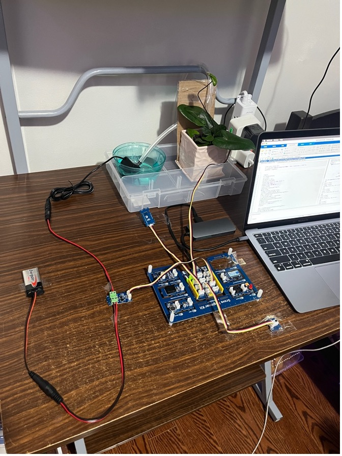
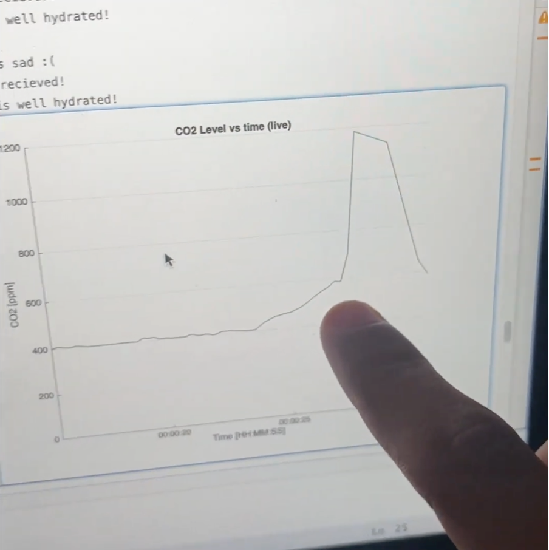

# 🌿 Plant-Tamagotchi System  

An interactive IoT-based plant care system inspired by Tamagotchi, combining automated watering, CO₂ monitoring, and interactive feedback to make plant care fun and responsible.

---

## 📖 Project Overview  

This system uses:
- **Arduino (C++)** for sensor control, pump activation, and OLED messages.
- **MATLAB** for real-time CO₂ graphing and live monitoring.
- Components: Soil moisture sensor, SGP30 CO₂ sensor, pump, buzzer, LEDs, OLED display.

---

## 📂 Repository Structure  

Plant-Tamagotchi-System/
├── Arduino_Code/ # OLED and plant control code
├── MATLAB_Code/ # CO₂ monitoring and automation
├── Images/ # System and graph images
├── Documentation/ # Project report PDF
└── README.md # This file

---

## 📸 Demo  

  

---

## 🔧 How to Run  

### Arduino:
- Open `Arduino_Code/OLED_Display.ino` in Arduino IDE.
- Upload to Arduino Uno.
- Connect sensors and OLED display as per code pin definitions.

### MATLAB:
- Install MATLAB support package for Arduino Hardware.
- Run `MATLAB_Code/CO2_Monitoring_and_Control.m`.
- Connect to the correct serial port in the code.

